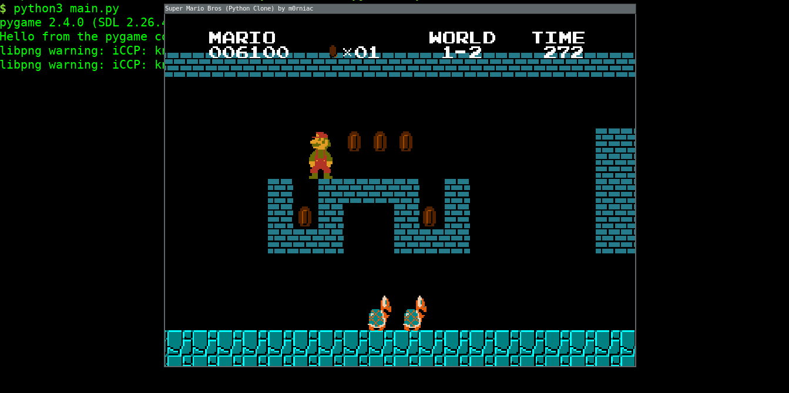

# Super Marios Bros (Python Clone)

This project is a recreation of the classic game Super Mario Bros using the Python programming language. Players can relive the nostalgic experience of the original game in a version entirely developed in Python code


## Installation of VENV (Recommended)

Install virtual environment on Linux (Debian based):

```bash
sudo apt install python3-venv
```
```bash
pip3 install virtualenv
``` 

Install virtual environment on Microsoft Windows:

```bash
pip install virtualenv
```
## Cloning repository including VENV

- Linux (Debian based):
```bash
python3 -m venv supermario && source supermario/bin/activate && git clone https//github.com/m0rniac/supermario temp_folder && mv temp_folder/* . && rm -r temp_folder && deactivate
```
```bash
cd supermario
```
```bash
source bin/activate
```
```bash
pip3 install -r requirements.txt
```


- Microsoft Windows:
```bash
python -m venv supermario && supermario\Scripts\activate.bat && git clone https://github.com/m0rniac/supermario temp_folder && move temp_folder\* . && rmdir /s /q temp_folder && deactivate
```
```bash
cd supermario
```
```bash
.\Scripts\activate
```
```bash
pip install -r requirements.txt
```
# CONTROLS:
| Key       | Description              |
|-----------|--------------------------|
| ↑         | Move Up                  |
| ↓         | Move Down                |
| →         | Move Right               |
| ←         | Move Left                |
| S         | Sprint                   |
| SPACE     | Jump                     |


## RUN:
- Linux (Debian based)
```bash
python3 main.py
```
- Microsoft Windows
```bash
python main.py
```

## Screenshots




## Feedback
If you have any feedback, please reach out to me at:

[](https://www.instagram.com/christcastr/)

[](https://www.paypal.com/paypalme/christcastr/)
